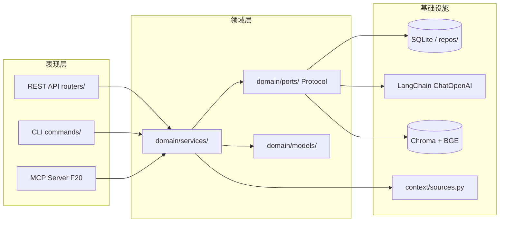

# InkFlow Architecture — 架构导航

> 本文档回答「**在哪里改代码**」：组件职责、目录导航、模块类型谱系、加新模块的步骤。
> 项目总约定（SDD/TDD/编码规范/ADR 治理）见 `AGENTS.md`；功能清单见 `FEATURES.md`。

---

## 1. 系统概览

InkFlow 是 **模块化单体**（ADR-001）：单人团队不需要微服务，但模块间通过 `typing.Protocol` 严格隔离，为将来按需拆分预留。

```
表现层 (API / CLI / MCP / GUI)  →  领域层 (Service + Model + Port)  ←  基础设施层 (实现 Port)
```

- **领域层零框架依赖**：domain/ 不得 import FastAPI/Typer/SQLAlchemy/LangChain（CI 强制检查，ADR-015）
- **多表现层共享领域**：REST API 是本地内核通信契约（ADR-021），CLI/MCP 是同等地位的表现层适配器
- **本地优先**：SQLite + 免认证（Phase 1-3）；2.0.0 云端 = PostgreSQL + JWT + BYOK（ADR-024）

## 2. 完整目录树

```
D:\develop\projects\
├── InkFlow\                         # 主仓库（main 分支，只读）
│   ├── AGENTS.md                    # 项目总约定（AI 编码助手唯一真相源）
│   ├── CLAUDE.md                    # 其他工具入口跳板（指向 AGENTS.md）
│   ├── ARCHITECTURE.md              # ← 本文件（架构导航）
│   ├── CONTRIBUTING.md              # 人类贡献者指南
│   ├── ai-traps.md                  # AI 编码常见陷阱完整清单（AGENTS.md §9 引用）
│   ├── README.md / FEATURES.md / LICENSE
│   ├── adr\                         # ★ ADR 决策记录（索引见 adr/README.md）
│   │   ├── README.md                #   ADR 索引 + 编号规则（38 条有效，2026-08-16）
│   │   └── ADR-NNN.md               #   单个决策记录（Nygard 格式）
│   ├── design\                      # ★ 产品/架构设计文档
│   │   ├── prd-inkflow-v2.1-2026-07-30.md   #   PRD（文件名 v2.1，内容 v2.2 修订）
│   │   ├── architecture-analysis-2026-07-30.md
│   │   ├── workflow.md              #   开发工作流详解
│   │   ├── phase1-gate-review-2026-08-01.md
│   │   └── ...（product-positioning / security-analysis-cloud / env-readiness）
│   ├── docs\                        # 用户使用说明（纯用户文档）
│   │   ├── README.md
│   │   └── images\                  #   架构图 PNG（README 引用）
│   ├── specs\                       # SDD 规格文件（每个 feature 一个目录）
│   │   ├── f1-project-service\ ... f7-cli-interface\   #   Phase 1（F8 无 spec，见 ADR-018）
│   │   ├── f9-character-service\ ... f16-style-service\  #   Phase 2 创作工具链
│   │   ├── f19-gui\                #   0.3.0 GUI（内核进程化 §2 ✅ PR #85 / Electron 壳、渲染层占位）
│   │   ├── f23-sse-stream\         #   0.3.0 传输增强（SSE 流式）
│   │   └── p0-11-cloud-protocols\   #   云端接口 Protocol spec
│   ├── frontend\                    # ★ 前端（0.3.0 F19 GUI 起；云 Web 一套两用，ADR-020）
│   │   └── packages\                #   pnpm workspace 双包：renderer（React19+Vite6）+ electron（薄壳）
│   ├── ci_cd\                       # ★ CI 质量护栏（check_file_length / check_noqa_reason / api-coverage.md）
│   ├── backend\
│   │   ├── pyproject.toml           # 项目配置、依赖、工具设置
│   │   ├── uv.lock                   # 依赖锁定（ADR-025，唯一真相，CI --frozen）
│   │   ├── src\inkflow\             # ★ 源码
│   │   │   ├── __main__.py          # CLI 入口
│   │   │   ├── core\                # 配置、数据库、日志（config / database / log / model_registry）
│   │   │   ├── domain\              # ★ 领域层（核心，不依赖任何框架）
│   │   │   │   ├── models\          #   聚合/实体/值对象（Project, Chapter, ... 11 个）
│   │   │   │   ├── services\        #   领域服务（业务编排，含 _*_extractor 私有实现）
│   │   │   │   └── ports\           #   出站端口（Protocol；cloud\ 子目录 = P0-11 云端接口）
│   │   │   ├── infrastructure\      # 基础设施层（实现 domain/ports）
│   │   │   │   ├── database\        #   SQLAlchemy + SQLite（models\ ORM + repositories\）
│   │   │   │   ├── llm\             #   LangChain LLM（ChatOpenAI 路由 + templates\）
│   │   │   │   ├── agent\           #   LangGraph StateGraph 管道（+ tools\ + deepagents\）
│   │   │   │   ├── rag\             #   RAG 检索（Chroma + BGE，F14 落地）
│   │   │   │   ├── context\         #   F6 上下文数据源（sources.py，F13 伏笔注入）
│   │   │   │   ├── kernel\          #   内核进程（HTTP 内核，GUI/CLI serve）
│   │   │   │   ├── scheduler\       #   后台任务调度（F44 run/refresh，F45 M2）
│   │   │   │   ├── background\      #   后台任务辅助（background_refresh coroutine 契约）
│   │   │   │   └── assets\          #   静态资源/资产存储
│   │   │   ├── api\                 # ★ 表现层：REST API（app.py / deps.py / routers\）
│   │   │   ├── cli\                 # ★ 表现层：CLI（app.py / context.py / output.py / commands\）
│   │   │   └── mcp\                 # ★ 表现层：MCP Server（F20 已实现，ADR-023；含 tools\）
│   │   └── tests\                   # ★ 单元测试（纯后端，无 I/O）
│   │       └── unit\                #   255 个测试文件（纯函数 + Mock + DTO 校验）
│   ├── tests\                       # ★ 集成 + E2E 测试（顶层，跨后端/前端）
│   │   ├── conftest.py              #   共享 DB fixture（db_session, sample_project, ...）
│   │   ├── integration\             #   仓储 + 服务层集成测试
│   │   ├── api\                     #   FastAPI HTTP 集成测试（ASGITransport）
│   │   ├── cli\                     #   CLI 集成测试（CliRunner + 临时 SQLite）
│   │   └── e2e\                     #   全栈端到端（真实 LLM，e2e-ai 开关，4 文件）
│   └── .github\                     # CI 配置
│       └── workflows\ci.yml
│
└── InkFlow-ft\                      # git worktree 工作目录（并行 feature）
    └── <feature>\                   # 每个 feature 一个工作副本（如 agent-constraints）
```

## 3. 组件职责表

| 组件 | 路径 | 职责 |
|------|------|------|
| **core** | `src/inkflow/core/` | 配置（pydantic-settings）、数据库引擎/会话、日志（Loguru）、模型注册表 |
| **domain/models** | `src/inkflow/domain/models/` | 纯 Pydantic 聚合/实体/值对象（零框架依赖） |
| **domain/services** | `src/inkflow/domain/services/` | 业务编排；`_*_extractor`/`_*_generator`/`_*_analyzer` 私有实现 |
| **domain/ports** | `src/inkflow/domain/ports/` | 出站端口 Protocol（仓储/LLM/向量库/云接口）；`cloud/` = P0-11 |
| **infrastructure/database** | `src/inkflow/infrastructure/database/` | SQLAlchemy ORM（models\）+ 仓储实现（repositories\） |
| **infrastructure/llm** | `src/inkflow/infrastructure/llm/` | LangChain ChatOpenAI（custom base_url 兼容多 Provider，ADR-005v2）+ prompt_manager（str.replace 渲染，非 Jinja2）+ templates\ |
| **infrastructure/agent** | `src/inkflow/infrastructure/agent/` | LangGraph StateGraph 管线（F4 角色链） |
| **infrastructure/rag** | `src/inkflow/infrastructure/rag/` | Chroma + BGE 向量检索（F14，ADR-013） |
| **infrastructure/context** | `src/inkflow/infrastructure/context/` | F6 上下文数据源（sources.py：角色/世界观/伏笔/时间线注入） |
| **infrastructure/kernel** | `src/inkflow/infrastructure/kernel/` | 内核子进程：HTTP 内核（GUI/CLI serve 共用内核 API） |
| **infrastructure/scheduler** | `src/inkflow/infrastructure/scheduler/` | 后台任务调度（F44 run/refresh，F45 M2 后台刷新） |
| **infrastructure/background** | `src/inkflow/infrastructure/background/` | 后台任务辅助（background_refresh coroutine 参数契约） |
| **infrastructure/assets** | `src/inkflow/infrastructure/assets/` | 静态资源/资产存储 |
| **api** | `src/inkflow/api/` | FastAPI app + deps 装配 + routers\（每模块一个 router） |
| **cli** | `src/inkflow/cli/` | Typer app + commands\（每模块一组命令）；JSON 信封 + 退出码契约（F7 spec §5） |
| **mcp** | `src/inkflow/mcp/` | MCP Server（F20 已实现：server/tools/ + DTO；经 cloud/mcp_transport 上云） |

## 4. 模块类型谱系（新模块落地导航）

每个已实现模块都是某个「变体」的样板。**写新模块 spec 时，先对照最接近的变体样板**：

| 变体 | 特征 | 样板 |
|------|------|------|
| 提取型 | 实体 CRUD + AI 提取（模板/重试/合并/幂等） | `specs/f9-character-service/spec.md`（F10 是其镜像成品） |
| 生成型 | 生成即新建（同名 422）+ save 预览参数 | `specs/f11-outline-service/spec.md`（§5.6 差异表） |
| 确定性检查型 | 无 LLM，确定性算法（§5 算法 + 完备性论证） | `specs/f12-timeline-service/spec.md` |
| 状态追踪 + F6 注入型 | 无 AI + 替换 F6 数据源 stub | `specs/f13-foreshadowing-service/spec.md`（§5） |
| 横切收敛型 | 非实体 CRUD：统一门面 + 分发既有入口 + 增量 hash + RAG | `specs/f14-extraction-service/spec.md` |
| 横切审计型 | 纯消费者：只读聚合 + 规则引擎 + 零跨模块 MODIFY | `specs/f15-audit-service/spec.md` |
| 确定性文本分析型 | 无 LLM 主体 + LLM 可选 + jieba 增强 | `specs/f16-style-service/spec.md` |
| 传输增强型 | 零新实体：流式通道 + 判别联合 DTO + SSE 帧协议 | `specs/f23-sse-stream/spec.md` |

## 5. 加新模块的步骤

1. **写 spec**（在 feature worktree）：读 `specs/f9-character-service/spec.md`（格式范例）+ 最接近的变体样板 + PRD 对应需求 + 相关 ADR（含 ADR-019 编号口径）。文件结构节必须与真实源码树一致，不照抄旧 spec
2. **拍板**：待澄清问题（Q1-Q3）由用户拍板后做 v1.x 修订（`references/spec-revision-playbook.md` 流程）
3. **RED 批**：先写全部测试，逐文件确认 FAIL
4. **GREEN 批**：分层实现（services → ports → infrastructure → api → cli）
5. **QA**：全仓 ruff（CI 等价命令）+ mypy + 分两条命令跑测试 + 覆盖率
6. **PR**：spec + 实现 + 测试同 PR（`Closes #N`），CI 绿后 squash merge
7. **收尾同步**：AGENTS.md 里程碑表 / FEATURES.md / ADR-019 版本表 / spec 头部状态

## 6. 关键数据流



## 7. 代码依赖图谱

- **`docs/code-map.md`** —— 模块级 **import 依赖图谱**（谁依赖谁）。2026-08-24 从 `backend/src/inkflow` 全量扫描生成（模块聚合到 2 级目录），含分层依赖图 + 完整依赖边表 + 架构收益分析。
- 本文档 §6 是 **数据流**（一次请求怎么走）；`docs/code-map.md` 是 **依赖方向**（谁 import 谁），两者互补。
- **值得注意**：`domain.services` 直接 import `infrastructure.database`/`infrastructure.agent`/`infrastructure.assets`（7/5/2 处），是干净架构（ADR-015）的潜在偏离信号，应经 `domain.ports` 反转——详见 `docs/code-map.md` §4。
