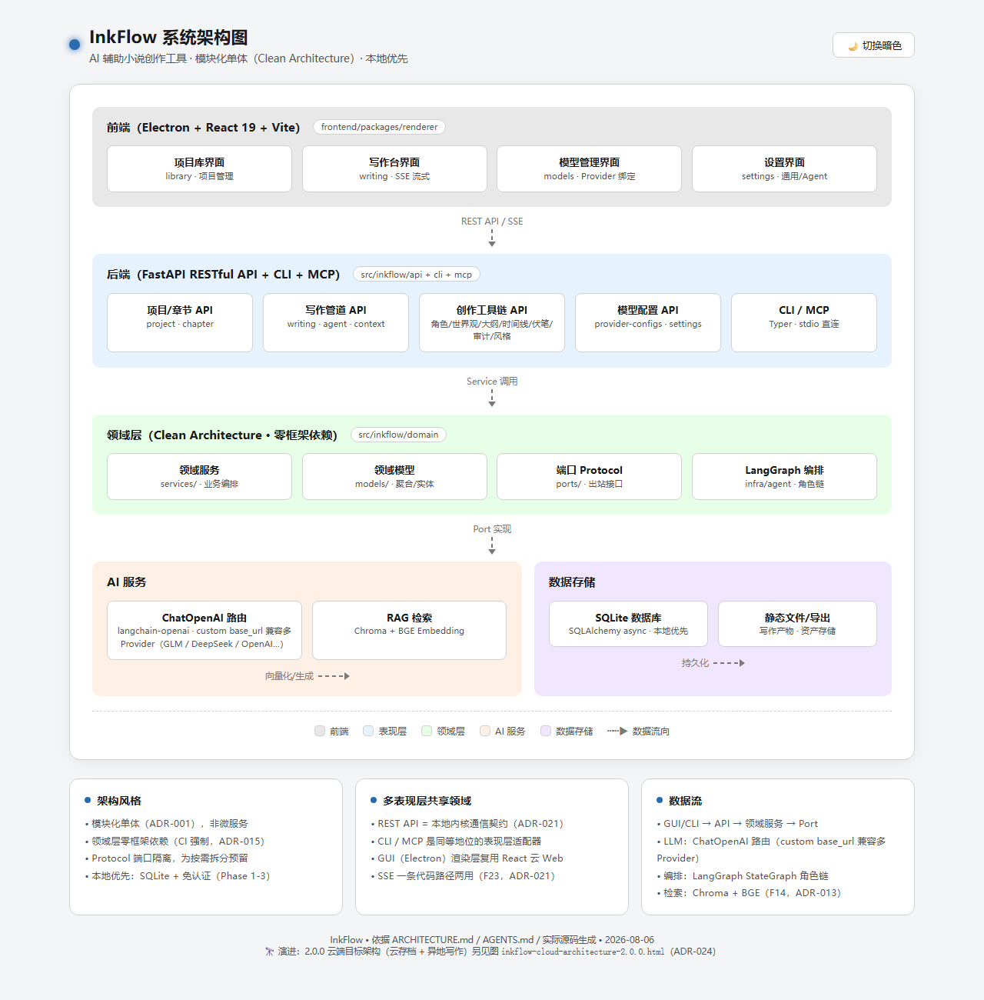
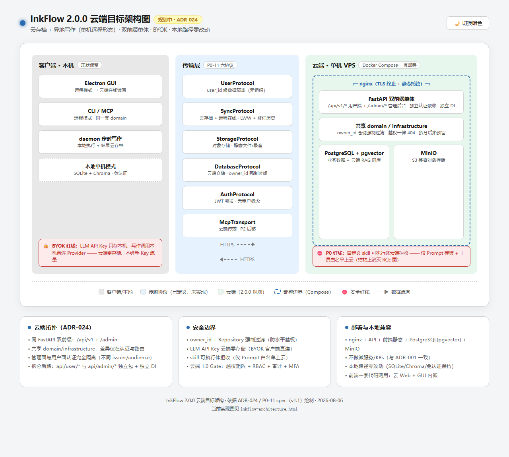

# InkFlow — AI 辅助小说创作工具

**本地优先的 AI 小说创作工作台**：用 AI 规划大纲、撰写章节、修订文本；管理角色、世界观、时间线、伏笔；审计一致性与风格痕迹。数据存本地，无账号，API Key 加密存储。

> **完整功能清单（当前 + 规划）见 [`FEATURES.md`](FEATURES.md)** —— 本文档只列要点。

## ✨ 功能特性

### 已实现

- **AI 写作管道**
  - 生成章节
  - 续写章节
  - 修订章节
  - Agent 角色链编排（架构师 / 写手 / 审阅 / 修订）
- **创作工具链**
  - 角色管理（档案 / 关系图谱 / 分组，AI 提取）
  - 世界观管理（条目 / 分类汇总，AI 提取）
  - 大纲管理（大纲 / 情节点 / 弧线，AI 生成）
  - 时间线管理（事件 / 叙事双时间线 + 一致性检查）
  - 伏笔管理（埋设 / 回收追踪，写作时自动注入上下文）
  - 统一提取（多类型一键提取 + 增量同步 + RAG 向量检索）
  - 一致性审计（角色 / 时间线 / 世界观 / 伏笔）
  - 风格检测（风格指纹 / AI 痕迹 / 词汇分析）
- **上下文智能装配**：写作时自动注入相关角色 / 世界观 / 伏笔
- **GUI 桌面端**
  - 项目管理
  - 写作页（三栏布局，SSE 流式输出）
  - Agent 配置
  - 模型管理
  - 设置页（持久化）
  - 侧边栏导航
  - 打包分发
- **Agent 化**
  - 会话管理
  - 本地内核服务化（冷启动 / 托盘常驻 / CLI 恒走 HTTP）
  - 编排完全体（三态模型选择 / 执行顺序编辑 / 管线模板 / 自定义 Agent）
  - Supervisor 自主编排 + 人工确认
  - 记忆系统（偏好学习 + 上下文注入）
  - 多 Agent（能力白名单 / skill 绑定 / 自定义编辑）
- **导出与检索**
  - TXT 导出
  - 全文搜索（FTS + 语义检索）
  - 章节审计
  - 世界观地点树 / 地图视图 / 跨书复制
  - 知识图谱
  - 检索页 RAG 增强
- **长任务编排**：一句话 → 全书（访谈规划 / 全书派发 / 失败恢复 + 中断干预）
- **记忆演进**：用户级偏好层 / 跨项目聚合 / 语义风格提取
- **skills 包**：官方轨 + 用户自定义轨
- **MCP Server**：外部 agent 经 stdio 调用
- **多界面**：CLI + REST API + GUI + MCP Server

### 规划中

- 云端（云存档 + 异地写作）

## 🚀 快速开始

前置：**Python 3.11+**，推荐 [uv](https://docs.astral.sh/uv/)。

```bash
# 1. 克隆
git clone https://github.com/zhx-xi/InkFlow.git
cd InkFlow/backend

# 2. 安装依赖（开发环境）
uv sync --extra dev

# 3. 查看 CLI（用 uv run 自动使用项目 venv backend/.venv）
uv run inkflow --help

# 4. 建一个项目试试
uv run inkflow project create "我的第一本小说"

# 5. 启动 REST API（Swagger: http://127.0.0.1:8000/docs）
uv run inkflow serve
```

> 不装 uv 也可以用 `pip install -e .`（在 `backend/` 目录下）。
> **Windows 注意**：不要直接敲 `python -m inkflow`——PATH 里的 `python` 可能解析到系统或其他虚拟环境（报 `No module named inkflow`）。统一用 `uv run`，或先激活项目 venv（`.\\.venv\\Scripts\\Activate.ps1`）再执行。

## 🏗️ 系统架构

**现状架构（模块化单体 + Clean Architecture）**：



**2.0.0 云端目标架构（云存档 + 异地写作，规划中，[ADR-024](adr/ADR-024.md)）**：



> 交互版（浅色/暗色主题切换）见 [`design/inkflow-architecture.html`](design/inkflow-architecture.html) 与 [`design/inkflow-cloud-architecture-2.0.0.html`](design/inkflow-cloud-architecture-2.0.0.html)（浏览器打开）。

## 🗺️ 文档导航

| 文档 | 内容 | 读者 |
|------|------|------|
| [`FEATURES.md`](FEATURES.md) | **功能清单（当前 + 规划，唯一权威）** | 所有人 |
| [`CHANGELOG.md`](CHANGELOG.md) | 版本变更日志（0.1.0 → 0.9.0） | 所有人 |
| [`design/`](design/) | 产品规格（PRD）、架构分析、里程碑评审、开发工作流 | 开发者 |
| [`specs/`](specs/) | 功能规格书（每 feature 一份，SDD 真相来源） | 开发者 |
| [`adr/`](adr/README.md) | 架构决策记录（38 条 + 索引） | 开发者 |
| [`backend/README.md`](backend/README.md) | 后端包说明（结构 / 开发环境 / 版本号机制） | 开发者 |
| [`docs/`](docs/README.md) | 使用说明（用户手册 / CLI 参考 / API 文档，建设中） | 用户 |
| [`AGENTS.md`](AGENTS.md) | AI 编码助手说明书（项目总约定 + 治理规则） | AI agent |

## 🧭 里程碑

| 版本 | 主题 | 状态 |
|------|------|------|
| 0.1.0 | 核心引擎（F1-F8 + 云端 Protocol） | ✅ |
| 0.2.0 | 创作工具链（F9-F16，1589 tests / 覆盖率 91%） | ✅ |
| 0.3.0 | GUI 桌面端 + SSE 流式（F19/F23 提前） | ✅ |
| 0.3.1 | 质量加固：LLM 客户端修复 · LangGraph 状态重构 · 真实 AI CI · 覆盖率补全（2200+ tests / 后端 98.9% 行 / 96.3% 分支 / 前端 99.1% / 92.5%） | ✅ |
| 0.4.0 | 打包 + GUI 演进（NSIS/便携 ZIP 分发 · 导航重构 · 模型管理 · Agent 模板） | ✅（v0.4.0 2026-08-07 正式发布） |
| 0.5.0 | 会话 + 内核服务化 + 设置持久化 + E2E 分层 | ✅（v0.5.0 2026-08-08 正式发布） |
| 0.6.0 | 导出 + 全文搜索 + 章节审计 + 世界观三连 + CLI 恒 HTTP + E2E 设置页 | ✅（2026-08-09 里程碑关闭） |
| 0.7.0 | Agent 化升级（deepagents harness · Writer Agent 闭环 · 记忆系统 · 数据目录设置 · 模型测试 · E2E/bug 批） | ✅（v0.7.0 2026-08-12 正式发布） |
| 0.8.0 | 编排完全体 + Supervisor + 设定库 + RAG 指纹 + skills + CLI（F42/F29/F43/F19-skills/F10） | ✅（2026-08-13 里程碑 18/18 issues 全关） |
| 0.9.0 | 多 Agent 一期 + MCP + RAG 切片 + DAG 编排（F39/40/41 + F20 + F46 + 写作管线增强） | ✅（2026-08-17 正式发布，21/21 issues 全关） |
| 0.10.0 | 长任务编排器 + 记忆演进（F44 一句话→全书 + F45 记忆 AI 总结） | ✅（2026-08-18，20/20 issues 全关） |
| 0.11.0 | UI/产品修复批（前置重构 + 访谈 LLM + chat 重构 + 知识图谱 + 检索页 + 模型/设置 + Agent 链动态化 + 会话/记忆 UI；原 0.10.1 更名 2026-08-20） | ✅（2026-08-22 正式发布，49/49 issues 全关） |
| 1.0.0 | 本地完全可用（CLI + GUI + skills + MCP） | 🔜 |
| 2.0.0 | 云端（云存档 + 异地写作） | 🔜 |

## 🛠️ 技术栈

Python 3.11 · FastAPI（REST）· Typer（CLI）· SQLAlchemy 2 async + SQLite（未来 PostgreSQL）· LangChain / LangGraph + Deep Agents harness（deepagents 0.7.5，agentic 编排，0.7.0 起）+ 自研 LangGraph StateGraph Supervisor 动态路由（F29，0.8.0 起）· Chroma + BGE（RAG）· React 19 + Vite 6 + shadcn/ui + Zustand + Tailwind 4（前端，0.3.0 起）· Electron 34（桌面壳，0.3.0 起）

架构：**模块化单体 + Clean Architecture**（domain / infrastructure / api / cli 分层，依赖方向单向），决策全部记录于 [`adr/`](adr/README.md)。

## 📄 License

MIT
