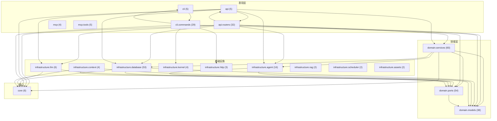

# InkFlow 代码图谱（模块级 import 依赖）

> 本文档是 **代码依赖图谱**——从 `backend/src/inkflow` 每个 `.py` 文件的 `from/import inkflow.*` / `patch("inkflow.*")` 语句自动扫描生成，展示**模块之间的 import 依赖关系**。
> 与 `ARCHITECTURE.md` 的关系：`ARCHITECTURE.md` 回答「**在哪里改代码**」（目录职责 + 组件表），本文档回答「**谁依赖谁**」（模块耦合 + 依赖方向）。两者互补，导航按需切换。
> 生成：2026-08-24 全量扫描，模块聚合到 2 级目录。

---

## 1. 总体分层依赖图

节点 = 2 级模块目录；箭头 = A 模块的代码 import 了 B 模块（这里只画 import 计数 ≥ 5 的主边，次要边见 §3）。括号内为模块文件数。

**依赖方向结论**（干净架构校验）：
- ✅ **表现层 → 领域层**：`api`/`cli` 依赖 `domain.services`/`domain.models`/`domain.ports`（正确方向）。
- ✅ **领域层零框架依赖**（ADR-015）：`domain.services`/`domain.models`/`domain.ports` **不依赖** `api`/`cli` 表现层。*唯一例外*是 `domain.services → infrastructure.database/agent`（7+5 处，见 §4）。
- ✅ **基础设施 → 领域层**：`infrastructure.database`/`llm`/`agent` 依赖 `domain.models`/`domain.ports`（实现端口，方向正确）。
- ✅ **基础设施/表现层 → 核心**：依赖 `core`（config/database/log）。

---

## 2. 分层节点与文件数

| 层 | 模块桶 | 文件数 | 职责 |
|----|-------|-------|------|
| 表现层 | `api` | 5 | FastAPI app + deps 装配 |
| 表现层 | `api.routers` | 32 | 每模块一个 router |
| 表现层 | `cli` | 5 | Typer app + JSON 信封 |
| 表现层 | `cli.commands` | 29 | 每模块一组 CLI 命令 |
| 表现层 | `mcp` / `mcp.tools` | 4 / 5 | MCP Server + tools |
| 领域层 | `domain.models` | 38 | 聚合/实体/值对象 |
| 领域层 | `domain.ports` | 54 | 出站端口 Protocol（含 cloud/） |
| 领域层 | `domain.services` | 60 | 领域服务（业务编排） |
| 基础设施 | `infrastructure.database` | 53 | SQLAlchemy ORM + repositories |
| 基础设施 | `infrastructure.llm` | 6 | LangChain ChatOpenAI |
| 基础设施 | `infrastructure.agent` | 16 | LangGraph 管道 + tools/deepagents |
| 基础设施 | `infrastructure.context` | 4 | 上下文数据源 |
| 基础设施 | `infrastructure.kernel` | 4 | 内核子进程（HTTP 内核） |
| 基础设施 | `infrastructure.http` | 3 | HTTP 客户端 |
| 基础设施 | `infrastructure.scheduler` / `background` | 2 / 2 | 后台调度 / 后台任务辅助 |
| 基础设施 | `infrastructure.assets` / `rag` | 2 / 2 | 资源 / RAG 检索 |
| 核心 | `core` | 6 | config/database/log/model_registry |

---

## 3. 完整依赖边（按 import 计数降序）

> 主图只画 ≥5 的高权重边；以下是 **全部** 模块间依赖（`src_bucket → dep_bucket`，计数 = import/patch 语句数）。

| src | → | dep | 计数 |
|-----|---|-----|-----|
| `domain.services` | → | `domain.ports` | 167 |
| `domain.services` | → | `domain.models` | 101 |
| `cli.commands` | → | `cli` | 52 |
| `api.routers` | → | `domain.ports` | 42 |
| `api.routers` | → | `domain.services` | 41 |
| `api` | → | `domain.services` | 40 |
| `api.routers` | → | `domain.models` | 32 |
| `api` | → | `infrastructure.database` | 31 |
| `api.routers` | → | `api` | 30 |
| `infrastructure.database` | → | `domain.models` | 26 |
| `cli.commands` | → | `infrastructure.kernel` | 25 |
| `infrastructure.database` | → | `core` | 25 |
| `cli.commands` | → | `infrastructure.http` | 24 |
| `domain.ports` | → | `domain.models` | 21 |
| `api.routers` | → | `infrastructure.database` | 15 |
| `api.routers` | → | `core` | 11 |
| `api.routers` | → | `infrastructure.llm` | 10 |
| `api.routers` | → | `infrastructure.agent` | 9 |
| `cli.commands` | → | `domain.models` | 9 |
| `domain.services` | → | `core` | 9 |
| `infrastructure.agent` | → | `domain.models` | 9 |
| `infrastructure.context` | → | `domain.models` | 9 |
| `api` | → | `core` | 8 |
| `api` | → | `infrastructure.agent` | 8 |
| `cli` | → | `cli.commands` | 8 |
| `infrastructure.agent` | → | `domain.ports` | 8 |
| `domain.services` | → | `infrastructure.database` | 7 |
| `api` | → | `infrastructure.llm` | 6 |
| `infrastructure.context` | → | `domain.ports` | 6 |
| `domain.services` | → | `infrastructure.agent` | 5 |
| `mcp.tools` | → | `api.routers` / `domain.models` | 4 / 4 |
| `api` | → | `infrastructure.context` | 3 |
| `domain.models` | → | `domain.ports` | 3 |
| `infrastructure.agent` | → | `domain.services` | 3 |
| `infrastructure.context` | → | `domain.services` | 3 |
| `mcp.tools` | → | `infrastructure.kernel` / `infrastructure.http` | 3 / 3 |
| `domain.services` | → | `infrastructure.assets` | 2 |
| `api` | → | `api.routers` / `infrastructure.scheduler` | 2 / 2 |
| `api` | → | `api.middleware` / `infrastructure.rag` / `infrastructure.assets` | 1 / 1 / 1 |
| `api.routers` | → | `infrastructure.repositories` / `background` / `scheduler` / `mcp` | 1×4 |
| `infrastructure.database` | → | `domain.services` / `infrastructure.llm` / `domain.ports` | 1 / 1 / 2 |
| `infrastructure.context` | → | `infrastructure.database` / `llm` / `background` | 1×3 |
| `infrastructure.repositories` | → | `domain.models` / `infrastructure.database` | 2 / 2 |
| 其余 | → | （`kernel→core`、`http→cli/kernel`、`assets→domain.ports`、`rag→domain.ports`、`llm→domain.services/models/database`、`agent→infra.database/core/llm`、`context→infra.database/llm/background`、`<root>→cli` 等） | 各 1 |

---

## 4. 值得注意的依赖（架构收益）

1. **`domain.services → infrastructure.database`(7) / `infrastructure.agent`(5) / `infrastructure.assets`(2)** —— 领域层直接 import 基础设施，**违反干净架构（ADR-015）的潜在信号**。应通过 `domain.ports` 的 Protocol 依赖倒置，让 `domain.services` 只依赖端口。这几处是后续架构改进的优先项。

2. **`domain.ports → domain.models`(21)** —— 端口（Protocol）签名引用领域模型是**合理的**（用模型类型）。✅

3. **`api → infrastructure.database`(31)** —— API 层直接 import 数据库，集中在 `api/deps.py` 装配点。属可接受（依赖注入），但 `api/deps.py` 当前 890 行贴线，是重构重点（见 issue #636）。

4. **`cli.commands → infrastructure.kernel`(25) / `infrastructure.http`(24)** —— CLI 直接调用内核 HTTP 客户端 + HTTP 层，符合「CLI 与 GUI 共享内核 API」设计。✅

> 注：本图为**模块级**聚合（2 级目录）。真正文件级图（300+ 节点）过于庞大、不可读，故聚合呈现。数据为 2026-08-24 真实扫描。

<!-- mermaid-end -->
